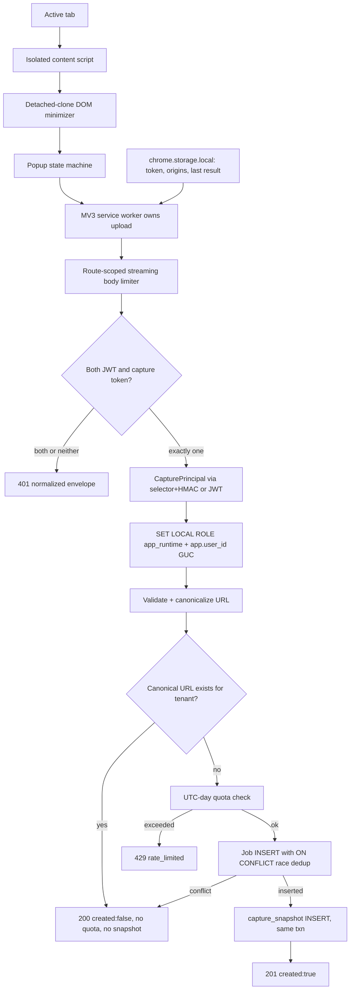

# Browser Extension Implementation Plan v1 (Release 0.2)

Status: DRAFT for PO ratification. Produced 2026-07-20 from a 5-round multi-model deliberation (panel: Claude Fable, GPT-5.6, Gemini 3.5; synthesis + dissent preserved at scratchpad/extension-deliberation/runs/20260717-171231-6bea8c/ -- the scratchpad is disposable, this document is the durable record). Binding parent spec: docs/plans/full-stack-implementation-plan-v3.md (the Release 0.2+ "Contract revision + extension tokens" bullet and its Security fixed points). Product stories: STORY-ADD-004, STORY-AUTH-010 (employa-bot-front-end story map). Delivery process: docs/plans/loop-research/sprint-treadmill-process.md.

## PO rulings recorded (Wes, 2026-07-20, in-session AskUserQuestion)

| ID | Ruling |
|---|---|
| DEC-EXT-001 | 93 operations. NO token-check endpoint; paste is syntax-validated only, authentication proven by the first capture. Amends STORY-AUTH-010's "validates against an authenticated endpoint" AC -- capture-token auth attaches to exactly one operation (captureJob). |
| DEC-EXT-002 | Relax five job columns to nullable (company, location, work_mode, employment, posted) + add capture_note. One populated-table migration with row-preservation proofs + five named ripple suites. Staging-table alternative rejected. |
| DEC-EXT-003 | FORCE RLS stays on extension_token with ONE named, narrow SELECT policy (extension_token_verifier_lookup) for the ratified connection role, consumed only by the capture verifier. This is the precedent pattern for every future non-JWT credential. The exact connection role MUST be ratified from repo inspection at ext-02 S0, never assumed. |
| DEC-EXT-004 | Numbers bundle accepted, all Settings-backed: token TTL 90d, active-token cap 5, capture quota 50/user/UTC-day (count-based, small race overrun accepted -- abuse guard, not billing), snapshot cap 2 MiB, request body cap 2.25 MiB, snapshot retention 90d. Oversized pages are REJECTED (popup "page too large" state); never truncated, no partial capture. Revisit only if the ext-04 heavy-page fixture check trips. |

Entry criterion zero: gate-0.1 is BLOCKED; Wes authorized the pre-approved gate-0.1-repair (2026-07-20). This queue activates only after the repair run returns a recorded PASS (or a subsequent Wes ruling).

## 1. Mission, scope, non-goals

Ship a Chrome-compatible Manifest V3 WebExtension that captures the rendered job posting in the current tab into the authenticated user's account, with the API surface, token auth, storage, security hardening, settings UI, tests, CI, and treadmill phases it requires.

Story reconciliation (deviations stated, not hand-waved): a capture creates a Job (not an Application; no INBOX stage is added -- the shipped 12-stage taxonomy is untouched); captured jobs land on the existing DB-backed /jobs surfaces; the DOM snapshot is stored write-only for the future extraction increment (no parse, no fetch, no render, no read endpoint); the PAT story maps onto v3's selector+HMAC scheme.

In scope: contract 89 -> 93 with full governance; extension-token lifecycle (mint/list/revoke, expiry, scope, cap, re-auth-to-mint); dual-auth captureJob with dedup semantics; Job nullable relaxation + capture_note; capture_snapshot storage with caps and retention; the extension/ MV3 client; /settings/extension-tokens UI; backend/frontend/extension/e2e test suites and extension CI.

Non-goals: auto-submit or autofill (founder-locked: never an automated applying tool); creating Applications at capture; server-side fetching (store-only -- URL normalization, not an SSRF guard); JSON-LD/board-specific extraction (deferred; manual-edit-first per v3); LLM calls or AI budget interaction; email channel; snapshot viewing; store submission, signing, production host config, Firefox support; object storage or a periodic retention scheduler.

## 2. Architecture

Trust boundaries: the page is untrusted (isolated content script, detached clone, no page mutation); the raw token lives only in the service worker + chrome.storage.local (never page context, DOM, query params, logs); the pre-principal verifier can look up a token row but can never return a User; all tenant writes happen only after the role+GUC transition (RLS backstop + app-level predicate belt, PR-1); snapshot HTML is write-only this increment.

## 3. Contract delta (89 -> 93)

Governance (frozen-contract rule): DEC-EXT-001..004 recorded above satisfy the PO-ruling requirement; remaining steps at ext-01 -- CONTRACT-NOTES deltas, version bump, mvp-api.yaml additions, operation-ownership entries, regenerate backend/app/schemas.py + frontend/src/client, wire mappers/fixtures updated, empty-second-regeneration proof, drift + manifest guards green. ApiError envelope everywhere; no HTTPException; no 403 mapping.

1. captureJob -- POST /api/v1/capture/jobs. Auth: exactly one of JWT bearer or X-Capture-Token (both/neither -> normalized 401). Body: sourceUrl (2048B), pageTitle (512c), detectedCompany (255c), htmlSnapshot (2 MiB), note (4096c); body cap 2.25 MiB streamed. 201 {job, created:true} / 200 {job, created:false} (dedup; no quota consumed; first snapshot wins). Errors: 401 unauthorized, 422 validation_error (fields/URL/oversize), 429 rate_limited (quota).
2. createExtensionToken -- POST /api/v1/settings/extension-tokens. JWT + current password (re-auth-to-mint); throttled BEFORE pwdlib. 201 {token: "ebx_v1_<selector>_<secret>", metadata} -- full token appears exactly once. Errors: 401, 402 cap_reached (5 active), 422, 429.
3. listExtensionTokens -- GET /api/v1/settings/extension-tokens. JWT. Metadata only (id, label, scope, createdAt, expiresAt, revokedAt, status); selector/digest/secret never returned.
4. revokeExtensionToken -- DELETE /api/v1/settings/extension-tokens/{id}. JWT. 204; unknown/cross-tenant -> 404 tenant-indistinguishable.

## 4. Data model and migrations

Every table honors the binding conventions: tenant user_id FK CASCADE, composite UNIQUE(user_id, id) anchor, composite FKs, FORCE RLS under app_runtime on the app.user_id GUC, timestamptz, named IS-TRUE-wrapped CHECKs, schema_version, DEBT-6 hand-strip.

Migration A (ext-02) -- extension_token: id, user_id, token_id varchar(64) UNIQUE (the selector: random, opaque, globally unique, indexed, non-enumerable), hmac_digest varchar(64) (HMAC-SHA256(EXTENSION_TOKEN_PEPPER, secret) -- pwdlib NEVER on this path), label, scope CHECK (= 'capture:job'), created_at/expires_at (CHECK expires > created), revoked_at NULL, schema_version. FORCE RLS: tenant-isolation policy for app_runtime + the DEC-EXT-003 verifier-lookup policy for the ratified connection role. Exact-artifact introspection tests (policy names, commands, roles, FORCE state) are Done-when conjuncts.

Migration B (ext-03) -- job relaxation (the increment's ONLY populated-table migration): company/location/work_mode/employment/posted -> nullable; capture_note varchar(4096) NULL added; affected named CHECKs rewritten NULL-safe ((col IS NULL OR ...) IS TRUE); uq_job_user_source_url retained (it was reserved for exactly this). Migration test runs against populated Release 0.1 rows: equal pre/post counts, values unchanged, constraints still reject bad non-NULLs, NULLs accepted, dedup index intact.

Migration C (ext-03) -- capture_snapshot: id, user_id, job_id, html text, byte_count CHECK (= octet_length(html) AND <= 2097152), captured_at, expires_at, schema_version; UNIQUE(user_id, job_id) (one snapshot per job, first wins); composite FK (user_id, job_id) -> job(user_id, id) CASCADE; FORCE RLS. No read endpoint. Retention: expires_at from Settings; idempotent STARTUP cleanup under an explicitly ratified maintenance path (no periodic timer); if a SECURITY DEFINER function appears it pins search_path = public, pg_temp with the exact-proconfig test (PR-13).

## 5. Security invariants (each becomes at least one named test)

1. Both-credentials (JWT + capture token) -> normalized 401 before any principal resolution; neither -> same 401.
2. get_capture_principal returns only CapturePrincipal(user_id, credential_id, auth_kind), never a User, and is attached ONLY to captureJob.
3. Verification = indexed selector lookup + HMAC-SHA256 + hmac.compare_digest; selector miss performs dummy digest work; expired/revoked/malformed/missing/wrong-secret all produce the same external 401.
4. pwdlib is never called on the capture path; mint throttling runs before password hashing; minting requires password re-auth.
5. Full token returned exactly once; never persisted plaintext; never in list responses, logs, page context, or query params; a 401 capture response deletes the extension's stored token.
6. Backend fails startup if EXTENSION_TOKEN_PEPPER is absent/unsafe outside approved test config.
7. Oversized bodies rejected while STREAMING (Content-Length and chunked both), before JSON parse; snapshot size checked in app code AND by the DB constraint.
8. No server-side fetch exists on the capture path; URLs are normalized (scheme/host lowercase, default ports and fragments stripped, tracking params removed, embedded credentials rejected), never resolved.
9. Captured strings render as escaped text only; snapshot HTML is never rendered (no dangerouslySetInnerHTML on any captured surface).
10. All tenant DB access post-auth goes through the role+GUC transition with app-level predicates; no Job write can precede it.
11. Cross-tenant token revoke/lookup is tenant-indistinguishable 404.
12. Every limit/TTL/cap/quota/origin from Settings or build profiles (W-1); the production build profile fails closed until real HTTPS origins exist.

## 6. Extension client

extension/ workspace in this monorepo: Bun + Vite + Biome, vanilla TypeScript, Vitest; the /dev/extension mockup is visual reference only, no code copied. MV3 manifest: permissions activeTab + scripting + storage only; host permission build-injected (localhost:8000 dev profile); restrictive CSP, no remote code, no eval.

Minimizer (detached clone): preserve JSON-LD scripts; strip other scripts, iframes/object/embed/noscript, on* attributes, comments, entered form state (values, checks, selections); serialize, measure UTF-8 bytes, REJECT over 2 MiB (DEC-EXT-004). The strip list is frozen by fixtures before implementation.

Service worker owns the upload and persists lastCaptureResult (popup close must not lose an in-flight result). Popup states: disconnected, invalid-token-syntax, ready, low-confidence ("This does not look like a job posting. Add anyway?"), page-too-large, capturing, success-created (links /jobs/{id}), success-duplicate, unauthorized (clears token, reconnect prompt), quota-reached, validation-error, network-error.

Browser matrix: pinned Chromium (CI, chained e2e), stable Chrome (dev target, manual smoke), Edge best-effort, Firefox deferred. Dev loading documented: compose up, build localhost profile, chrome://extensions -> Load unpacked, mint token at settings page, paste, capture.

## 7. Web-app surface

/settings/extension-tokens: list (metadata + revoke), mint flow (label + password -> one-time token display with copy; leaving the page discards it forever; "regenerate" = mint another, optionally revoke old -- no replaceTokenId op). Jobs surfaces tolerate the nullable fields with escaped "Not specified" placeholders; captureNote renders as plain text. The five-point ripple (wire mappers, fixtures, jobs list/filters, detail placeholders, deep-score null tolerance) closes as five separately named suites.

## 8. Testing and CI

Backend: test_extension_tokens.py, test_capture_jobs.py, verifier/envelope security suites, RLS both-direction probes, populated-migration suite, retention idempotency, two-connection dedup race with first-snapshot-wins, exact UTC-boundary quota test, throttle-before-pwdlib call-count proof. Frontend: settings-tokens unit + e2e, nullable-placeholder + escaping suites. Extension: minimizer fixture suite (exact strip list, JSON-LD preserved, oversize rejected), popup state machine, SW lifecycle (popup-closed-mid-upload, 401-clears-token), manifest/CSP validation. Extension CI job: frozen Bun install, Biome, tsc --noEmit, Vitest, production build, manifest validation, deterministic zip artifact.

Chained e2e (SEPARATE spec, frontend/e2e/extension-journey.spec.ts -- never coupled into core-journey.spec.ts; its persistent-context --load-extension flake profile must not endanger the 0.1 gate): login -> mint -> install token -> capture fixture page -> job + note visible in /jobs -> duplicate -> created:false -> revoke -> 401 -> token cleared + reconnect. Gate: 3 consecutive fresh-seed runs + zero ebx_v1_ occurrences across all logs.

## 9. Phases (treadmill queue draft -- Wes copies rows into approved-queue.md himself)

| ID | Phase | Exit gate | Checkpoint | Codex | p50/p90 |
|---|---|---|---|---|---|
| ext-01 | Rulings + contract 89->93 (regen, mappers, nullable wire fields) | drift+manifest green, empty-regen-diff proof | HUMAN DECISION at S0 (queue+rulings commit), then ADVISORY | D1 (fresh block) | 1 / 2 |
| ext-02 | Token infrastructure + settings UI (Migration A, selector+HMAC, mint/list/revoke) | exact RLS artifacts + both-direction probes + lifecycle suite green | ADVISORY | D1+D2 (first pre-principal credential exemplar; D2 charter: verifier reach, tenant leakage, uniform 401, pwdlib reachability) | 1.5 / 3 |
| ext-03 | Capture backend (Migrations B+C, streaming limiter, pipeline, quota, ripple) | populated-migration proofs + race tests + 51st-capture 429 + ripple suites green | ADVISORY | D1+D2 (populated migration + first streaming limiter; D2 charter: pre-role writes, dedup/quota interaction) | 2 / 3 |
| ext-04 | MV3 client + extension CI | client CI green + minimizer fixtures + manual compose capture evidence | ADVISORY | D1 (fresh block, first MV3 exemplar) | 2 / 3 |
| ext-05 | Integration hardening + chained e2e | 3 consecutive fresh-seed journey runs + token-leak sweep + XSS sweep + ledger terminal | ADVISORY | none unless tripwire | 1 / 3 |
| gate-0.2 | Terminal release audit (EXT AC matrix, fresh-clone drill, release-audit dispatch) | PASS recorded; frozen illegal | HUMAN DECISION, TERMINAL | release audit | 0.5 / 2 |
| gate-0.2-repair | Pre-approved repair, only after a FAIL, scoped to named failures | named failures closed | ADVISORY | per trigger | varies |

Totals: p50 ~8 sessions, p90 ~16. Shared non-terminal conjuncts: full gate suite green at the evidence commit; ledger terminal-only; progress.md evidence+retro+cost; GOAL.md retargeted verbatim.

## 10. Risk register (top; full register in the synthesis)

| Risk | L | Mitigation | Retired |
|---|---|---|---|
| Gate-0.1 BLOCKED stalls activation | certain | repair authorized; entry criterion zero | pre-queue |
| MV3 e2e flake | high | separate spec, pinned Chromium, 3-run gate, SW lifecycle unit tests | ext-05 |
| Job-nullability ripple wider than five named points | med | S2 grep sweep pre-freeze; five named conjuncts | ext-03 |
| Verifier RLS policy wrong either direction / wrong role assumed | med | DEC-EXT-003 role ratification at ext-02 S0; both-direction probes; D2 charter | ext-02 |
| Real pages exceed 2 MiB post-minimization | med | heavy-page corpus fixture at ext-04 S2; PO revisits DEC-EXT-004 only on evidence | ext-04 |
| Streaming limiter bypass (chunked bodies) | med | both Content-Length and chunked oversize conjuncts | ext-03 |
| Token leakage to logs | low | ebx_v1_ log-sweep conjunct | ext-05 |

## 11. Dissent log (carried verbatim-condensed from the panel)

- One node preferred a 94th token-check op (earlier bad-paste feedback); overruled by DEC-EXT-001 -- the UX cost is accepted to keep capture-token auth on exactly one operation.
- Body-cap sizing (2.03 vs 2.25 MiB) settled at 2.25 by DEC-EXT-004.
- One node placed the Job relaxation migration in ext-01; the plan keeps wire nullability in ext-01 and the DB migration in ext-03 beside the code and ripple tests that prove it.
- The verifier-lookup policy is the highest-risk precedent; a policy TO postgres must never be copied literally -- the role is ratified from repo inspection at ext-02.
- The count-based quota is deliberately not concurrency-exact (abuse guard, not billing); accepted by DEC-EXT-004.
- Reject-on-oversize can make some heavy pages uncapturable; the ext-04 corpus check is the reopen trigger.
