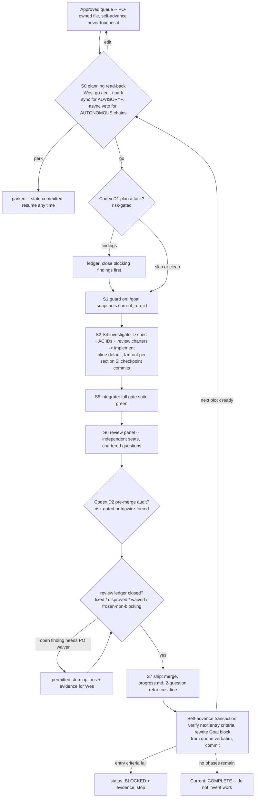

# Sprint Treadmill -- operating process for goal-loop sprints with Codex review and ultracode fan-out

Date: 2026-07-13, rev 2. Synthesized from three independently designed and adversarially critiqued candidates (treadmill-native, agile-team, token-economist lenses), then put through its own D1 protocol: a Codex (gpt-5.6-sol) adversarial review returned 14 findings (verdict UNSOUND); rev 2 dispositions every finding -- see the review ledger appendix. Ground truth: `docs/plans/loop-research/hoyle-re-goal-treadmill-investigation.md`, `docs/plans/loop-research/goal-treadmill-workflow-design.md`, `docs/plans/full-stack-implementation-plan-v3.md`.

The core identity: **a sprint is one pre-approved phase from the approved queue, executed as one or more guarded `/goal` invocations against the same `current_run_id`, ending in a transactional self-advance that prepares -- never executes -- the next sprint.** There is no sprint container beyond the phase itself. Agile vocabulary names moments the treadmill already has; anything agile that does not survive a results-per-token audit is deleted before it costs a token or a Wes decision.

Governing principles, carried verbatim from the ground truth:

- **Investigation earns automation.** The workflow may automate execution only after requirements, evidence, boundaries, transitions, and completion checks have become sufficiently formulaic.
- Checkpoint types: **AUTONOMOUS**: proceed when objective gates pass. **ADVISORY**: solicit independent analysis, then proceed using a recorded default. **HUMAN DECISION**: stop with options + evidence. **TERMINAL**: do not invent further work.
- Self-advance may mark the current phase complete, instantiate the exact next approved phase, carry forward evidence + debt, or set COMPLETE. **It may NOT create/split/merge/reorder phases, promote advisory->autonomous, alter AC, waive findings, choose product direction, or move past unmet entry criteria. Failed entry criteria -> `status: BLOCKED`, write evidence, stop.**
- Terminal condition, verbatim: **If no approved phases remain, set Current: COMPLETE, remove the active work goal, summarize optional debt, and stop.** Without it the agent is encouraged to manufacture work.
- "Done when:" has two schemas (Codex F14). **Non-terminal:** a CONJUNCTIVE, objectively verifiable predicate ending in "and GOAL.md retargeted to <the exact next approved phase>." **Terminal (Gate 0.1):** the release audit returns PASS with its evidence recorded, every ledger finding is at fixed/disproved/waived (frozen is illegal here), and `status: COMPLETE` is set with no retarget. COMPLETE on a FAIL audit is illegal.
- **Gate 0.1 failure path (Codex F3):** an audit FAIL sets `status: BLOCKED` with the failing evidence and a proposed repair scope written as options for Wes. The queue pre-approves ONE `gate-0.1-repair` transition: it may run only after a FAIL, only against the audit's named failures (no new scope), and returns to the terminal audit when its conjuncts close. A second FAIL is a HUMAN DECISION with no pre-approved path -- Wes re-plans or abandons.
- The closing self-policing rule: any proposed process change that cannot be expressed as an edit to GOAL.md, the approved queue, docs/progress.md, or the guard contract is ceremony, and is rejected by construction.

## Runtime reality (honest statement of what enforces what)

The `/goal` command with its session-scoped Stop hook is CLI-level infrastructure observed working in hoyle-re; it is not defined in this repo, and the goal-treadmill plugin (validators, `goal_loop.py snapshot/audit`, machine-readable Stop evaluator) does NOT exist and is deliberately not a dependency of v1 (section 9). Compensations, in order:

1. GOAL.md carries YAML frontmatter and a Completion evidence table (predicate -> evidence -> verification command) so the semantic completion audit has structure to check against, not vibes.
2. **Run manifest (Codex F7/F9):** at S1 guard-on, before any work, the session appends a run-manifest entry to progress.md and commits it: `current_run_id`, the commit SHA of GOAL.md as invoked, the queue file's commit SHA (which must be a Wes-authored or Wes-approved commit), and the list of Done-when conjuncts verbatim. The completion audit judges against THAT manifest, not against whatever GOAL.md says later. The retarget commit that changes GOAL.md is the final deliverable of the CURRENT run, not an extension of it (the observed hoyle-re resolution of the retargeting paradox). This is still an agent-behavior contract until tooling enforces it, but the manifest makes post-hoc goal rewriting detectable in git history rather than invisible.
3. Sprint 1 is an attended dry run: Wes watches the first self-advance land. This substitutes for the unbuilt validator on exactly the transition where it matters most.
4. Kill-safety, stated precisely (Codex F12): the Stop hook only intercepts stop ATTEMPTS; commit-at-block-boundary discipline plus progress.md's exact-next-action are the real abandonment protection. A kill BETWEEN block boundaries can leave a dirty tree with no accurate next-action. Therefore every invocation starts with a **resume preflight**: inspect `git status` and the last run-manifest/progress entry; if the tree is dirty or the last session ended without a checkpoint commit, classify the run as abandoned-dirty, write a recovery checkpoint (stash-or-commit to the sprint branch with a `wip-recovery` marker, note what is verified vs suspect), and require synchronous S0 review before resuming. A clean tree resumes directly.
5. Sprint 1's entry criteria include verifying `/goal` exists and behaves as described (one invocation, one attempted early stop). If it does not, sprints run attended until the plugin ships.
6. **Activation gate (Codex F8):** none of the operating artifacts exist until activation. Before Sprint 1's S0, a one-time attended setup creates `docs/plans/loop-research/approved-queue.md` (Wes commits it), `GOAL.md` (instantiated from the queue's first row), and `docs/progress.md` (empty scaffold with the section headings). Activation is rejected if any cross-reference in GOAL.md frontmatter points at a missing file or the queue copy diffs from the authority.

Multi-session rule (fixes the sprint-arithmetic error): `current_run_id` stays fixed for the whole phase (e.g. `sprint-01-run-1`). Each work session runs the resume preflight, then re-invokes `/goal Complete the snapshotted current run in @GOAL.md` against the same run; the completion audit judges committed repo state plus the evidence table against the run manifest, so inherited commits from earlier sessions count. The run id increments only if the phase is restarted from scratch after a BLOCKED reset.

## 1. The cycle in one diagram



## 2. Sprint anatomy, step by step

| Step | What happens | Executor |
|---|---|---|
| S0 | Planning read-back: Goal block (already drafted by last sprint's self-advance), checkpoint type, entry-criteria re-verification scoped to "did the repo drift since the advance commit", queue diff vs the authoritative queue file, Proven-patterns proposal diff, carried debt. Wes gives ONE decision: go / edit / park. His "go" ratifies the batch of retro proposals at their stated default dispositions; he can override any line. | wes + inline |
| S0-async | For a chain of consecutive AUTONOMOUS low-risk phases, S0 is asynchronous: the committed retarget IS the read-back; the treadmill continues and Wes holds a standing veto he can exercise between sessions. Synchronous S0 is mandatory for: ADVISORY or HUMAN-DECISION phases, the first sprint, and the first sprint after any BLOCKED or abandoned run. | wes (async) |
| S0b | Conditional Codex plan attack (dispatch D1, section 4). Blocking findings close before guard-on. | codex |
| S1 | Guard on: `/goal Complete the snapshotted current run in @GOAL.md`. Wes may leave. | inline |
| S2 | Investigation: confirm the plan's facts against the code; label findings CONFIRMED/INFERRED/UNKNOWN. Fan out finder/verifier only when the map is genuinely unknown. | inline (workflow if unmapped) |
| S3 | Spec: freeze the phase mini-spec, minting stable AC IDs as predicates freeze (the traceability matrix is assembled incrementally here, never retro-fabricated at Gate 0.1); write per-seat falsifiable review charters (1-3 questions each, drawn from v3 Verification); write work orders for any fan-out packets. Judgment work, stays inline. | inline |
| S4 | Implementation: inline Sonnet-with-work-order by default; parallel implementer/verifier packets only under section 5 conditions. TDD, semantic checkpoint commits at every block boundary, progress.md packet entries (this is the standup -- no meeting exists). | inline / workflow |
| S5 | Integration: merge packets, run the full gate suite (`bash scripts/lint.sh`, both test suites, compose boot), fix seams. | inline |
| S6 | Review: independent panel (section 5) with chartered questions; conditional Codex D2 audit; every finding enters the ledger and reaches a terminal disposition (section 4). ADVISORY phases apply their recorded defaults here and proceed; they do NOT stop for Wes unless a finding needs a waiver or a HUMAN-DECISION escalation fires. | workflow + codex |
| S7 | Ship: merge to master, update progress.md (completed-sprint entry with outcomes, evidence, review results -- this absorbs the CHANGELOG role, see section 9), the 2-question retro (below), the one-line cost note (sessions used, fan-out count, Codex dispatches), then the self-advance transaction. | inline |
| Between | Wes reads progress.md and, for ADVISORY/HUMAN-DECISION phases, the human-facing demo evidence. On AUTONOMOUS phases the e2e run in the completion-evidence table IS the demo; no separate recording is produced for nobody. | wes |

**The 2-question retro (structurally capped: <=10 lines, appended to progress.md).** Q1: what Proven-patterns deltas or process proposals does this sprint's evidence justify? These are PROPOSALS with stated default dispositions -- inert until ratified at the next S0, expired if unadopted after 2 plannings. Q2: what debt goes on the open-debt ledger, with severity? Debt entries are agent-writable directly; pattern and process changes are not. There is no Q3: "does anything invalidate the next phase's entry criteria" is answered by the self-advance transaction itself, and two mechanisms answering one question means one is filler.

**Tangent protocol (sanctioned, named).** Wes interrupting a guarded run with a tangent is expected, not exceptional. The path: park the tangent on progress.md's parked-tangents list (agenda for the next S0, or route to the ideas repo), or if the tangent must run NOW, `/goal clear`, handle it, re-invoke against the same `current_run_id` later. Neither breaks the machine.

**Work-order integrity (S4).** Round-4 escalation may rewrite a work order, but every rewrite is logged in progress.md as a diff, and a rewrite that weakens an acceptance predicate touching a Done-when conjunct is illegal -- quality shrinkage must be as visible as scope growth.

## 3. Role contract

**Wes -- Product Owner.**
- MAY: approve/edit/reorder/split the approved queue (every edit bumps `queue_revision`); assign and promote checkpoint types; grant waivers by name; resolve HUMAN-DECISION checkpoints and frozen findings; ratify or kill retro proposals at S0; abandon any sprint at any moment (safe by construction); decide at Gate 0.1 whether the project continues.
- MAY NOT (by his own design, for his own decision load): be handed more than one decision moment per checkpoint, and that moment arrives with options and evidence attached; be needed mid-sprint on an AUTONOMOUS phase; be asked an open question when a recorded advisory default exists; be the executor of mechanical work.

**Claude Code -- lead / orchestrator.**
- MAY: run the 5-stage contract; decompose and write work orders; dispatch workflows and Codex within section 7 budgets; adjudicate panel-internal conflicts (ledgered, visible at S0); correct discovered FACTS in specs; add debt to the ledger; execute the self-advance to the exact next approved phase.
- MAY NOT: add/split/merge/reorder phases; promote a checkpoint toward autonomy; alter acceptance criteria; waive findings; downgrade a reviewer-assigned severity (a downgrade is a waiver, and waivers are Wes's); choose product direction; edit the authoritative queue file, ever; advance past unmet entry criteria; invent work after the terminal phase.

**Codex (gpt-5.6-sol via mcp__codex__codex) -- independent adversarial reviewer.**
- MAY: attack committed artifacts at the dispatch points in section 4; assign severity to its own findings; re-audit closures via `codex-reply`; demand evidence.
- MAY NOT: edit anything; implement fixes; be treated as approval authority (findings route through the ledger); review a vibe (committed artifacts only); be dispatched outside the defined points -- it is metered because it is expensive, and its value is different failure modes, proven by the four adversarial reviews that reshaped v2 into v3.

**Workflow agents -- the team.**
- MAY: execute written work orders (Sonnet implementers); independently verify against work orders and charters (Sonnet verifiers, Haiku for mechanical sweeps); hold review-panel seats (tier per section 5); report out-of-scope discoveries to the lead for ledgering.
- MAY NOT: talk to Wes; touch GOAL.md, the approved queue, or progress.md (one writer for operating documents); commit to master; expand their work order; approve their own output (implementer and verifier are always distinct agents).

## 4. Codex review protocol

Codex is risk-gated, never a per-sprint floor -- the token-economist model, adopted because a mandatory audit on a 2-4 session sprint is 25-60 percent overhead for defects the panel and CI already bracket. Every dispatch reviews a committed artifact and carries a falsifiable question. A dispatch that returns zero findings is itself recorded in the ledger ("no findings"), so rubber-stamping is a queryable pattern, not an invisible one.

**Dispatch points.** One normative trigger function decides dispatches (Codex F4/F5 -- the earlier draft had per-row overrides contradicting the triggers; those are removed). MUST triggers are never cut by the section 7 degradation order; the degradation order applies only to the discretionary tier.

- **D1 MUST fire when:** the Goal block is written fresh rather than instantiated verbatim from a queue row + proven template, OR the phase carries a recorded hard-blocker note, OR the phase is flagged high-risk. **D1 MAY fire** (discretionary) on any ADVISORY phase the lead wants attacked.
- **D2 MUST fire when:** the sprint's diff touches credential/token verification or session semantics, creates or alters append-only mechanics, migrates a populated table, ships the FIRST instance of a binding schema convention that later sprints will copy (the exemplar -- defects there propagate), OR the rubber-stamp tripwire fired (section 8). Adding a new empty-table migration that pattern-follows a D2-audited exemplar does NOT alone trigger D2 -- the migration CI gates and the correctness seat cover it; this is the deliberate narrowing that keeps pattern-repeat sprints cheap. The queue's Codex column is DERIVED from these triggers, never hand-set; any extra dispatch a lead wants is labeled "discretionary" in the ledger.
- **D3 and the Gate 0.1 release audit** fire exactly as listed below.

| Dispatch | Artifact | The falsifiable question it must answer |
|---|---|---|
| D1 plan attack (pre-guard) | The Goal block + its Completion evidence table + the phase's plan section | "Name a sequence of actions that satisfies every Done-when conjunct while leaving the phase's real deliverable broken or unshipped." Plus: any subjective predicate, smuggled product decision, under-classified irreversible op, or evidence row that fails to discriminate done from not-done. |
| D2 pre-merge audit | The integrated branch diff + the sprint's review ledger + gate outputs + the evidence table | "Find a completion-evidence row whose evidence does not prove its predicate." Aimed at the named v3 invariants Codex itself authored: composite tenant FKs on every new child table, append-only actually enforced under the runtime role, the guarded versioned UPDATE aborting on zero rows before any child write, 401 uniformity, reservation-cap arithmetic, NUMERIC/timestamptz. |
| D3 escalation (rare) | The disputed finding + both positions | "Name a discriminating experiment whose outcome decides this finding." Run it; the result decides. |
| Gate 0.1 release audit | The e2e journey, fresh-clone drill transcript, incrementally-built AC traceability matrix | "Should this ship -- does the evidence demonstrate the founder journey end to end, from a clean clone, with no conjunct satisfied by letter-not-spirit?" |

Projected Release 0.1 spend under the trigger function (see the section 6 queue): sprint-01 D1+D2 (fresh block; auth boundary), sprint-02 D1+D2 (hard blocker: first DB vertical; first real migration under the binding conventions), sprint-03 none (pattern-repeat, empty-table migration), sprint-04 D1+D2 (hard blocker: concurrency; append-only mechanics), sprint-05 D1+D2 (high-risk: reservation arithmetic; append-only ai_run/match_report), Gate 0.1 release audit -- ~9 dispatches plus reply rounds across 15-27 sessions. The asymmetry (zero on sprint-03) is the cost posture working.

**Findings ledger (in progress.md; ledger closure is a Done-when conjunct).** Every finding -- Codex, panel seat, or verifier -- gets: stable ID, reviewer, reviewer-assigned severity, one-sentence finding, disposition, closure evidence as a command and its output (prose is not closure; "looks good" is an invalid disposition). The four terminal dispositions, exhaustive:

1. **fixed** -- with the verifying command output.
2. **disproved-with-evidence** -- for a Codex HIGH/MED finding this REQUIRES one `codex-reply` round presenting a runnable artifact (a test, a query), not prose; survival is decided by whether the artifact runs and discriminates, not by the lead's judgment of its own defense. Claude may not unilaterally close a Codex finding it disputes.
3. **waived-by-Wes** -- named authority only. "Open finding requiring a PO waiver, with options and evidence written to the ledger" is a standing permitted stop on every Goal block, so a waiver-needing finding is a sanctioned checkpoint, not an unsatisfiable conjunct.
4. **frozen-HUMAN-DECISION (non-blocking)** -- when Codex maintains a finding after the disprove round and Claude still disputes it. Both positions and evidence recorded in <=10 lines each. This state COUNTS AS CLOSED for the ledger conjunct but is automatically agenda'd for the next S0. If the finding is release-blocking, the sprint stops at the checkpoint for Wes instead. Any DISPUTED severity is treated as release-blocking -- the party who wants the guard released does not get to rate the dispute out of Wes's sight. **Terminal-boundary rule (Codex F11): frozen dispositions are ILLEGAL at Gate 0.1 -- there is no next S0 to consume them. Every finding open at the terminal phase must reach fixed, disproved-with-evidence, or waived-by-Wes before COMPLETE.**

Tiebreak authority is Wes, and he is reachable: the escalation path (disprove round -> D3 discriminating experiment -> frozen/stop) terminates at a permitted stop by construction. No third argument round exists.

## 5. Ultracode fan-out points

The stated bias: fan-out is admitted only where independence or parallelism buys something inline execution cannot, and a Sonnet implementer + Sonnet verifier rework loop is HYPOTHESIZED (not proven -- measure it in Sprint 1's cost line) to beat one Opus one-shot on quality via targeted-findings context. Quality comes from the loop; the panel and Codex are escalation tiers above it.

| Pattern | When | Tiers | When to skip |
|---|---|---|---|
| Review panel | Every implementation sprint. High-risk: 3 seats (QA/product-flow Sonnet, correctness/security Opus, simplification Sonnet). Low-risk: 2 seats (QA+simplification merged Sonnet, correctness Sonnet). | Sonnet seats, Opus correctness on flagged sprints | Never skipped and never inline-only: the floor is 2 independent-context seats even on pattern-repeat sprints, because inline self-review by the author is the correlated approval the panel exists to break. Every seat carries the 1-3 falsifiable charter questions minted at S3 (e.g. sprint-03 QA: "does intruder_client see another user's shortlist entry via list, get, or dedup-create?") -- role labels alone produce "looks fine". |
| Implementer/verifier rework loop | Fanned-out packets: implementer executes the work order, a DISTINCT verifier runs the gate commands and audits the diff, findings return to the SAME implementer with full context, max 3 rounds. Round 4 escalates to the lead, who fixes inline or rewrites the work order -- and every escalation is mandatory retro input, because a thrashing loop means the work order was broken, not the worker. | Sonnet/Sonnet | Inline implementation (the default) relies on the panel instead. |
| Parallel implementers | Only when a sprint has >=2 fully-specified work orders with no shared files (Phase A: test world vs seed module vs test-file split). | Sonnet | Sequential work (B3a -> 3b -> 3c is explicitly sequential) stays single-threaded; fan-out must beat inline on wall-clock without adding merge cost. |
| Finder/verifier mechanical sweeps | High-count low-judgment passes: the per-resource ownership matrix, the 401/CurrentUser sweep, envelope exactness, contract-drift audit, encoding checks. | Haiku finder, Sonnet verifier | Kept even on lean sprints -- cheapest defect source in the process. |
| Stays inline, always | Investigation synthesis, spec writing, decomposition, integration, migrations, GOAL.md/progress.md edits, the self-advance transaction, HUMAN-DECISION framing. One writer for state; judgment is never fanned out. | -- | -- |

Cut from the candidates: the separate S5 Opus judge panel. Its findings had no ledger destination and the verifier + correctness seat + D2 already bracket it; the algorithm-spec questions it would have asked (guarded UPDATE zero-row abort, reservation cap under two connections) are now the correctness seat's charter on flagged sprints.

## 6. GOAL.md sprint block template + worked example

**Queue authority (fixes the agent-rewritable-queue hole):** the authoritative approved queue lives in `docs/plans/loop-research/approved-queue.md`, committed and edited ONLY by Wes; every edit bumps `queue_revision`. GOAL.md carries a verbatim COPY for agent reasoning; the self-advance transaction copies the next row verbatim and never edits the authoritative file; the S0 read-back diffs the copy against the authority, so a drifted row is caught before guard-on. The Phase 0 + Phase A merge below is an explicit PO decision recorded at queue authoring (queue_revision 1 note), not an agent restructuring. v3 remains the binding SPEC; the queue file is the missing PLAN-level table (stable IDs, entry/exit criteria, checkpoint type, advisory defaults, hard-blocker check) that v3 does not contain.

**Template** (per-sprint block; scaffold from the investigation report, extended):

```markdown
---
goal_protocol: 1
queue_revision: <N, must match approved-queue.md>
current_phase: <sprint-NN-slug>
current_checkpoint: <AUTONOMOUS | ADVISORY | HUMAN DECISION | TERMINAL>
current_run_id: <sprint-NN-run-1>
next_phase: <exact next approved phase>
terminal_phase: gate-0.1-terminal-audit
approved_queue: docs/plans/loop-research/approved-queue.md
approved_plan: docs/plans/full-stack-implementation-plan-v3.md
progress_log: docs/progress.md
consecutive_clean_reviews: <n, maintained by self-advance>
status: <ready | running | BLOCKED | COMPLETE>
---

## Goal -- <sprint name>
> Do not stop until <deliverable> is integrated on master and GOAL.md is retargeted.
> 1. Investigation -- <named questions>; label findings CONFIRMED/INFERRED/UNKNOWN.
> 2. Spec -- <binding spec sections>; mint AC IDs; write per-seat review charters.
> 3. Implementation -- <branch; packets with work orders; sequential vs parallel tags>.
> 4. Reviews -- panel per charter; <Codex dispatches if triggered>; ledger closed per section 4 dispositions.
> 5. Ship -- gates green; progress.md completed-sprint entry + retro + cost line; self-advance this file to <next phase>.
> Done when: <conjunct> AND <conjunct> AND ... AND the review ledger has no finding outside a terminal disposition AND GOAL.md is retargeted to <next phase> and committed.
> Advisory questions and recorded defaults: <question -> default> (ADVISORY phases only; a question with no recorded default is a HUMAN DECISION).
> Stop only for: <phase-specific human-decision classes>; an open review finding requiring a PO waiver (options + evidence written to the ledger); a release-blocking frozen finding.

## Completion evidence
| Predicate | Evidence (commit SHA + exact command + exit status + durable output) | Verification command |

Evidence binding (Codex F10): every row's evidence names the commit SHA it was produced against; CI-backed rows reference a run for that SHA. At S7 the ship step re-checks that no evidence row is stale (older than the last commit touching its subject) -- stale evidence is re-run, not trusted.

### Self-advance (last Ship step, every run)
1. Record this phase under Completed in progress.md.
2. Select ONLY the next phase from the approved queue copy; diff the copy against approved-queue.md first.
3. Verify its entry criteria. Failed -> status: BLOCKED, write evidence, stop.
4. Rewrite the active Goal block for that phase, verbatim from the queue row.
5. Update consecutive_clean_reviews.
6. Commit the transition with the shipped work.
7. If no approved phases remain, set Current: COMPLETE, remove the active work goal, summarize optional debt, and stop.

## Proven patterns
<exemplars, canonical commands, known traps -- rewritten only via ratified retro proposals>

## Approved queue (copy of approved-queue.md rev N)
```

**Worked example -- Sprint 1 (v3 Phase 0 + Phase A, merged by PO decision at queue rev 1):**

```markdown
---
goal_protocol: 1
queue_revision: 1
current_phase: sprint-01-gates-and-foundation
current_checkpoint: ADVISORY
current_run_id: sprint-01-run-1
next_phase: sprint-02-jobs-manual-capture
terminal_phase: gate-0.1-terminal-audit
approved_queue: docs/plans/loop-research/approved-queue.md
approved_plan: docs/plans/full-stack-implementation-plan-v3.md
progress_log: docs/progress.md
consecutive_clean_reviews: 0
status: ready
---

## Goal -- Sprint 01: Phase 0 gates + Phase A foundation (ATTENDED DRY RUN -- Wes watches the first self-advance land)
> Do not stop until the CI gates and the DB-backed auth boundary are integrated on master and GOAL.md is retargeted.
> 0. Entry -- verify /goal exists and its Stop hook blocks one attempted early stop; if not, run attended.
> 1. Investigation -- confirm generate-client.sh's current source; inventory mixed contract test files and their subsystem split; map every mock route missing CurrentUser. Label findings CONFIRMED/INFERRED.
> 2. Spec -- binding spec is plan v3 "Phase 0" + "Phase A" + Design conventions; mint AC IDs per Done-when conjunct; charter the panel seats (QA: "can any mock route be reached without a token?"; correctness: "do invalid/inactive/unknown tokens produce byte-identical 401 envelopes through one code path, and do the migration tests exercise the runtime role?"; simplification: "is any of the test-world plumbing autouse magic v3 forbids?").
> 3. Implementation -- branch sprint-01-foundation. Packets: (P1) generate-client.sh reads mvp-api.yaml; (P2) CI generated-diff job + migration tests (empty-upgrade, head singularity, append-only trigger tests under the runtime role) + manifest validation, coverage gate to advisory; (P3) one DB test world: engine, outer-transaction rollback fixture, explicit db_client/store_client/intruder_client, seed_domain, no autouse-by-directory magic; (P4) split mixed contract test files by subsystem; (P5) auth boundary as ONE commit: CurrentUser on every mock route, 401 normalization, getCurrentUser served from the DB as the first implemented op, contract fidelity test; (P6) seed module + python -m app.scripts.seed [--reset], prestart behind SEED_DEMO_DATA=true; (P7) v3 auth conventions: login throttling before password verification, JWT iss/aud/iat/nbf/jti + session-version claim, shortened access-token lifetime, fail-closed SECRET_KEY outside local, allow_credentials=False + narrowed CORS, CSP for the SPA. P3/P4/P6 are independent and may run as parallel implementer/verifier pairs; P5 and P7 are sequential and inline.
> 4. Reviews -- 3-seat panel per charters; Haiku finder + Sonnet verifier sweep (no mock route lacks CurrentUser, no 403 remains in _STATUS_TO_KIND paths); Codex D1 already ran pre-guard (fresh block); Codex D2 fires (P5/P7 touch credential/token verification -- MUST trigger). Ledger closed per section 4.
> 5. Ship -- bash scripts/lint.sh + both suites + compose boot green; progress.md completed-sprint entry, retro, cost line; self-advance this file to sprint-02.
> Done when: generate-client.sh generates from mvp-api.yaml with the generated-diff CI job green AND migration + manifest CI jobs pass AND every mock route returns 401 without a token via the single normalized code path (sweep evidence) AND the 401 message is uniform across invalid/inactive/unknown AND getCurrentUser is implemented with the contract fidelity test green AND contract test files are split with the full suite green under the rollback fixture AND seed --reset produces a working login from a fresh compose stack AND the P7 auth conventions are implemented with their tests green (throttle, claims, lifetime, fail-closed secret, CORS, CSP) AND the review ledger has no finding outside a terminal disposition AND GOAL.md is retargeted to sprint-02-jobs-manual-capture and committed.
> Advisory questions and recorded defaults: coverage-gate relaxation to advisory -> default: relax, per v3 Delivery #6.
> Stop only for: a contract question mvp-api.yaml cannot answer (HUMAN DECISION); a CI platform limitation blocking a required job; any change that would require editing mvp-api.yaml; an open review finding requiring a PO waiver (options + evidence written to the ledger); a release-blocking frozen finding.

## Completion evidence (excerpt)
| Predicate | Evidence | Verification command |
| 401 normalization | fidelity test id + sweep report | uv run pytest tests/contract -q |
| migration gates | CI run URL, jobs green | gh run view <id> |
| seed from fresh stack | login succeeds against seeded user | docker compose up -d prestart && <login curl> |
| retarget | GOAL.md diff in the ship commit | git show HEAD -- GOAL.md |
```

**Approved queue (rev 1, authoritative copy lives in approved-queue.md; hard-blocker check recorded per row, full 12-dimension rubric scoring reserved for contested classifications):**

| ID | Phase (v3) | Exit gate | Checkpoint | Hard-blocker check | Risk | Codex (per trigger function) |
|---|---|---|---|---|---|---|
| sprint-01 | Phase 0 + A (merged, PO decision rev 1) + v3 auth conventions | 401 boundary + auth hardening + all CI gates green | ADVISORY (attended dry run) | blocker present: process itself unproven, template first-of-kind | med | D1+D2 (fresh block; touches token verification) |
| sprint-02 | B1 jobs, manual capture | created job persists + lists in browser; core-journey covers login->job | ADVISORY | blocker present: no shipped DB-vertical exemplar -- this sprint CREATES it (first migration under the binding conventions, RLS, composite FKs) | med | D1+D2 (hard blocker; first populated-schema conventions) |
| sprint-03 | B2 shortlist | unique(user_id, job_id) live; journey extended to shortlist | ADVISORY -- promotion path: Wes may flip to AUTONOMOUS by queue edit only after sprint-02 ships AND an exemplar-coverage mapping (which sprint-02 patterns cover shortlist's tenancy/dedup/UI/migration work) plus one recorded rubric score exist (Codex F13) | pending exemplar: one first-of-kind slice is asserted, not proven, to be representative | low | none (pattern-repeat; empty-table migration) |
| sprint-04 | B3 WHOLE: applications + minimal resume + snapshot together (v3's abandonment-safety rule; internal checkpoints 3a/3b/3c commit to the sprint branch; ONE final merge to master) | 3c journey gate incl. invalid_transition envelope; two-connection test (one winner, no orphan child rows); journey extended through application->applied->locked resume+snapshot | ADVISORY | blocker present: known high-severity uncertainty (concurrency, append-only mechanics, undo/undo_grant semantics) | high | D1+D2 |
| sprint-05 | B4 fake AI seam | fake score persists + renders; reservation-cap two-connection test; journey extended to match score | ADVISORY | high: reservation arithmetic; append-only ai_run | high | D1+D2 |
| gate-0.1 | Terminal audit | core-journey.spec.ts required in CI; fresh-clone drill | HUMAN DECISION, TERMINAL | -- | -- | release audit |
| gate-0.1-repair | Pre-approved repair: may run ONLY after a FAIL audit, scoped to the audit's named failures, no new scope; returns to the terminal audit | audit's named failures closed with evidence | ADVISORY | -- | varies | per trigger function (derived from what the repair diff touches) |

**B3 is one sprint, not three (Codex F2 -- restores v3 verbatim).** v3: applications, minimal resume, and resume_snapshot "move together in one slice" because no release checkpoint may depend on a cross-store relationship; B3a alone on master would have DB applications referencing mock resumes, exactly the forbidden seam. The 3a/3b/3c decomposition survives as internal checkpoints on the sprint branch (each individually gated and committed, resumable mid-sprint via the multi-session rule), and master sees only the completed slice. This sprint is the release's long pole (7-12 sessions); its run manifest and progress.md discipline carry it across sessions.

**Incremental journey rule (Codex F1).** `frontend/e2e/core-journey.spec.ts` is born in sprint-02 and EXTENDED in every implementation sprint's Done-when: the sprint's segment joins the journey and the whole spec runs green from a fresh seed. Gate 0.1 verifies a test that has been passing cumulatively; it never discovers a cross-sprint seam for the first time. The fresh-seed run is each sprint's demo evidence on AUTONOMOUS/ADVISORY phases.

**Auth conventions ownership (Codex F6).** v3's binding auth conventions -- login throttling before password verification, JWT `iss/aud/iat/nbf/jti` + session-version claim, shortened access-token lifetime, fail-closed `SECRET_KEY` outside local, `allow_credentials=False` + narrowed CORS, and the CSP pairing for localStorage retention -- are owned by sprint-01 packet P7 and appear in its Done-when. Nothing binding from v3 is left ownerless; any deferral is an explicit PO edit to the queue notes, not an omission.

Sprint-02 is ADVISORY, not AUTONOMOUS: "no representative shipped exemplar for pattern work" is a hard blocker that prohibits AUTONOMOUS, and B1 is the first real DB vertical. Queue rev 1 contains no AUTONOMOUS rows at all -- autonomy is EARNED via the sprint-03 promotion path, never granted by fiat. Advisory questions + recorded defaults for sprints 01-02 and 04-05 are enumerated in approved-queue.md (e.g. sprint-02: "does the jobs schema satisfy every binding convention before the first migration commits? -> default: proceed when the correctness seat and D2 both confirm; otherwise stop for waiver"). Promotion of any row toward autonomy is a one-line Wes edit to approved-queue.md, deliberately frictional.

## 7. Cost budget per stage + degradation order

Denominated in fractions of one focused session; v3 estimates Release 0.1 at 15-27 sessions (p50 ~20). Honest blended overhead: **12-15 percent at p50**, not the under-10 the candidates claimed -- percentages blend by session mass, not sprint count, and the multi-session resume tax (re-reading GOAL.md + progress.md + the v3 section on every re-invocation) is real and recurring because abandonment is expected, not exceptional. The recovery levers are small sprints (small diffs = cheap reviews), no CHANGELOG, and risk-gated Codex.

| Stage | Mechanism + tier | Cost | Degradation order for simple sprints |
|---|---|---|---|
| S0 planning | inline + Wes go/edit/park; async on AUTONOMOUS chains | ~2 percent | never cut (it is the safety gate); async chaining removes the Wes stall, not the check |
| S0b Codex D1 | 1 dispatch | one dispatch | MUST-triggered D1s are never cut; discretionary D1s cut 2nd |
| S2 investigation | inline; finder/verifier if unmapped | small | fan-out cut 1st |
| S3 spec + charters + AC IDs | inline Opus | small; shrinks to "copy exemplar N" on pattern-repeats | never zero -- charters are what keep the panel real |
| S4 implementation | inline Sonnet w/ work order; parallel pairs per section 5 | the actual work | parallelism cut 1st, stay inline |
| S4 rework loops | Sonnet implementer/verifier, <=3 rounds | included in packets | the verifier pass is never cut |
| S5 integration | inline | small | never |
| S6 panel | 3 seats high-risk / 2 seats low-risk | ~15-20 percent of a session full; ~10 lean | shrinks 3 -> 2 seats; NEVER below 2 independent seats, never inline-only |
| S6 sweeps | Haiku + Sonnet | ~5 percent | keep -- cheapest defect source |
| S6 Codex D2 | 1 dispatch + <=1 reply round | one dispatch | MUST-triggered D2s are never cut; no discretionary D2 exists (D2 is trigger-derived only) |
| S7 retro + cost line + self-advance | inline | ~3 percent | never (it is the treadmill) |
| Resume tax | context re-establishment per session of a multi-session phase | ~5-10 percent of each resumed session | reduced by progress.md exact-next-action discipline, not cuttable |

Cut order under budget pressure, explicit -- and it applies ONLY to the discretionary tier; MUST-trigger dispatches (section 4) are never cut: (1) parallel implementers, (2) discretionary D1s, (3) panel 3 -> 2 seats. The floor that always stands: S0, the 2-seat chartered panel, the sweeps, the verifier pass, the capped retro, the self-advance transaction, the guard, and every MUST-trigger Codex dispatch. Release-wide Codex spend under the trigger function: ~9 dispatches.

## 8. Failure modes -> catching mechanism

| Failure mode | Catching mechanism |
|---|---|
| Ceremony cosplay (rituals that change nothing) | Every ceremony's exit condition is a named artifact delta with a downstream consumer (planning -> GOAL.md diff; retro -> proposals with 2-planning expiry; review -> ledger rows); the guard's predicates never mention ceremony outputs; the S7 cost line makes spend visible per sprint; the closing self-policing rule rejects unexpressible process changes by construction. |
| Review rubber-stamping | "Looks good" is an invalid disposition; zero-finding dispatches are recorded rows; the `consecutive_clean_reviews` frontmatter counter (maintained by self-advance -- the rule has state) counts panels with zero MED+ findings, and at 2 forces a Codex D2 on the next sprint regardless of risk flag; a clean forced-D2 is accepted as-is and resets the counter, so the rule cannot socially pressure manufactured findings. |
| Mid-sprint abandonment (expected, not exceptional) | Semantic checkpoint commits at block boundaries; progress.md exact-next-action + clean-session handoff; the next session runs the resume preflight (dirty tree or missing checkpoint -> recovery checkpoint + synchronous S0) then re-invokes /goal against the same current_run_id -- inherited commits count. Stated honestly: the hook prevents false completion declarations; commit discipline + the preflight, not the hook, protect against walkaways -- a kill BETWEEN block boundaries is exactly what the preflight exists to catch (Codex F12). |
| Scope creep via retro or "helpful" self-advance | Retro emits proposals, never changes; proposals expire after 2 plannings; the self-advance MAY-NOT list (verbatim above) forbids phase creation; the authoritative queue is a Wes-only file the self-advance never touches; queue_revision + the S0 queue diff make drift visible; mid-sprint product ideas land on the parked-tangents list. |
| Codex/Claude disagreement deadlock | Exhaustive dispositions + the mandatory codex-reply disprove round (runnable artifact, not prose) + D3 discriminating experiment + frozen-HUMAN-DECISION with both positions in <=10 lines; disputed severity = release-blocking; no third round exists; Wes is the named, reachable tiebreaker via a permitted stop. |
| Waiver deadlock (finding neither fixable nor disprovable) | "Open finding requiring a PO waiver" is a standing permitted stop on every Goal block, and frozen-non-blocking is a legal terminal ledger state -- the ledger conjunct can always be satisfied without gaming it. |
| Predicate gaming (letter-not-spirit Done) | The Completion evidence table binds each conjunct to a command with observable output; D1's falsifiable question hunts gameable predicates before the guard arms; the high-risk predicates are un-fakeable by construction (two-connection tests and runtime-role trigger tests assert on DB state, not code shape); AC IDs minted at S3 make the Gate 0.1 traceability matrix incremental fact, not retro-fabrication. |
| Self-advance past a broken foundation | Entry-criteria verification is a mandatory transaction step; failure -> status: BLOCKED + written evidence + stop; the S0 read-back re-checks only for drift since the advance commit (scoped, not a re-read ritual). |
| Autonomy inflation | Checkpoint type lives in frontmatter copied verbatim from the Wes-only queue; self-advance may not alter it; the hard-blocker check is recorded per queue row; promotion is a deliberate one-line Wes edit. |
| Rework-loop thrash | Hard 3-round cap; round 4 escalates to the lead; every escalation is mandatory retro input (a thrashing loop means the work order was broken); work-order rewrites are logged diffs and may not weaken Done-when-touching predicates. |
| S0 stall on Wes (homework-shaped demand) | Synchronous S0 only where his judgment is actually needed (ADVISORY+, first sprint, post-BLOCKED); AUTONOMOUS chains run on async veto; his one decision arrives batched with default dispositions. |
| Queue drift / silent restructuring | The authoritative queue file + queue_revision + S0 diff; the 0+A merge itself is stamped as a PO decision at rev 1 so the very first queue teaches the rule, not the exception. |

## 9. What is deliberately NOT in v1 of this process

- **The goal-treadmill plugin.** No `goal_loop.py` validate/snapshot/audit, no machine-readable Stop evaluator, no bootstrap command. v1 runs on bare `/goal` + structured GOAL.md + the attended Sprint 1 dry run. Building the plugin is a separate project; this release is partly its pilot evidence.
- **CHANGELOG.md.** In hoyle-re it had a real consumer (parent-repo submodule integration). Here it would duplicate progress.md for a repo with one reader. Completed-sprint entries in progress.md carry the outcomes-with-evidence record until an external consumer (a release, a second reader) exists.
- **Unattended multi-phase recursion, automatic phase creation, automatic waivers.** The safe reusable unit is one guarded, pre-approved phase per invocation.
- **Full 12-dimension rubric essays per phase.** The hard-blocker checklist is mandatory and recorded per queue row; the scored rubric runs only when a classification is contested. Investigation earns automation; paperwork does not.
- **A separate Opus judge panel.** Folded into the correctness seat's charter on flagged sprints; a review whose findings have no ledger destination is theater.
- **Scrum ceremony imports:** no standup meetings (progress.md at checkpoint commits is the standup), no story points or velocity (v3 already sized the phases), no backlog grooming (the queue is frozen between PO edits), no separate stakeholder demo (the phase gate is the demo, and on AUTONOMOUS phases the e2e evidence row IS the demo -- no recordings for nobody).
- **Restoring the 41 retired frontend vitest suites, MSW, or any Phase-E productionization** -- out of scope per v3.
- **A Codex runtime adapter or any access to Codex's native goal database.** Codex is a reviewer here, not a second treadmill runtime.
- **Cross-release process generalization.** This spec governs Release 0.1. If Gate 0.1 says continue, the retro evidence (cost lines, ledger patterns, escalation counts) re-derives v2 of the process instead of extrapolating from hope.

## Appendix: Codex D1 review ledger (2026-07-13, thread 019f5cad-f90e-71e2-9f48-2a84d85a0fac)

The spec's own review protocol, applied to the spec. Reviewer: Codex gpt-5.6-sol, falsifiable question: "name a compliant action sequence that leaves Release 0.1 broken." Verdict on rev 1: UNSOUND. All 14 findings dispositioned in rev 2; none frozen, none waived.

| ID | Sev | Finding (one line) | Disposition |
|---|---|---|---|
| F1 | HIGH | No cross-sprint journey test until Gate 0.1; compliant sequence ships broken seams; no repair path | fixed: incremental journey rule (core-journey.spec.ts born sprint-02, extended per sprint) + pre-approved gate-0.1-repair row |
| F2 | HIGH | B3 split into 3 master-merged sprints violates v3 abandonment-safety (DB applications referencing mock resumes) | fixed: B3 re-merged into one sprint-04; 3a/3b/3c demoted to sprint-branch internal checkpoints; one final merge |
| F3 | HIGH | Gate 0.1 FAIL has no legal recovery state | fixed: terminal outcomes defined (PASS -> COMPLETE; FAIL -> BLOCKED + repair transition; 2nd FAIL -> HUMAN DECISION) |
| F4 | HIGH | Worked sprint-01 said "no D2" while the D2 trigger names auth | fixed: sprint-01 gets D2; trigger narrowed to credential/token verification, append-only, populated-table migrations, tripwire |
| F5 | HIGH | Dispatch table, queue rows, and cut order contradicted each other | fixed (after closure re-audit flagged residue): trigger function gains the exemplar-first-instance MUST trigger (covers sprint-02); queue Codex column and gate-0.1-repair derived, never hand-set; cost-table cut language rewritten to discretionary-only |
| F6 | HIGH | v3's binding auth conventions (throttle, JWT claims, lifetime, fail-closed secret, CORS, CSP) were ownerless | fixed: sprint-01 packet P7 + Done-when conjunct; deferral requires explicit PO queue edit |
| F7 | HIGH | "Snapshotted run" claimed but no snapshot exists; mutable GOAL.md can redefine a run | fixed (lite): committed run manifest at S1 (GOAL.md SHA, queue SHA, conjuncts verbatim); audit judges the manifest; full validator remains the plugin project |
| F8 | HIGH | approved-queue.md, GOAL.md, progress.md do not exist; nothing to guard or diff | fixed: activation gate creates and cross-validates all three before Sprint 1 S0 |
| F9 | MED | Wes-only queue is policy without authority; agent could edit both copies | fixed: run manifest pins the queue's Wes-approved commit SHA; unapproved revisions rejected at S1 |
| F10 | MED | Completion evidence self-asserted, not bound to commit/environment | fixed: evidence rows carry commit SHA + command + exit status; S7 stale-evidence re-run rule |
| F11 | MED | Frozen findings evaporate at the terminal boundary (no next S0) | fixed: frozen dispositions illegal at Gate 0.1 |
| F12 | MED | Kill between block boundaries leaves dirty tree + stale next-action; "kill-is-always-safe" overstated | fixed: mandatory resume preflight (dirty-state classification, recovery checkpoint, sync S0 after abandoned-dirty) |
| F13 | MED | Sprint-03 AUTONOMOUS on an asserted, unproven exemplar | fixed: sprint-03 ADVISORY with explicit promotion path (exemplar-coverage mapping + one recorded rubric, Wes queue edit) |
| F14 | LOW | Non-terminal Done schema ("retargeted to next") contradicts the terminal rule | fixed: two Done schemas (non-terminal / terminal) |
